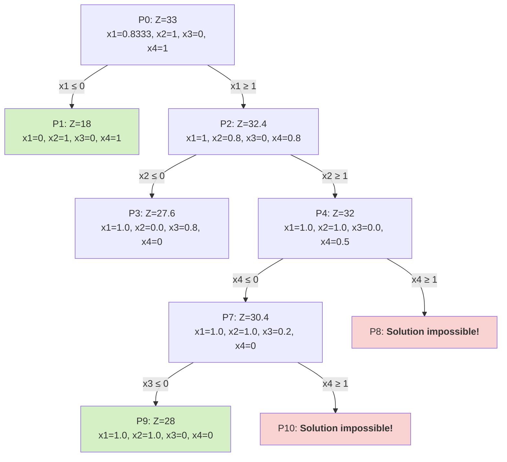

# optimisation

```mermaid
graph TD
    P0["P0: Z=33<br>x1=0.8333, x2=1, x3=0, x4=1"] 
    P1["P1: Z=18<br>x1=0, x2=1, x3=0, x4=1<br>"] 
    P2["P2: Z=32.4<br>x1=1, x2=0.8, x3=0, x4=0.8"]
    P3["P3: Z=27.6<br>x1=1.0, x2=0.0, x3=0.8, x4=0<br>"] 
    P4["P4: Z=32<br>x1=1.0, x2=1.0, x3=0.0, x4=0.5<br>"]
    P7["P7: Z=30.4<br>x1=1.0, x2=1.0, x3=0.2, x4=0<br>"]
    P8["P8: <b>Solution impossible!</b>"]
    P9["P9: Z=28<br>x1=1.0, x2=1.0, x3=0, x4=0<br>"]
    P10["P10: <b>Solution impossible!</b>"]
    
    P0 -->|x1 ≤ 0| P1
    P0 -->|x1 ≥ 1| P2
    P2 -->|x2 ≤ 0| P3
    P2 -->|x2 ≥ 1| P4
    P4 -->|x4 ≤ 0| P7
    P4 -->|x4 ≥ 1| P8
    P7 -->|x3 ≤ 0| P9
    P7 -->|x4 ≥ 1| P10
    
    style P1 fill:#d4f0c4
    style P9 fill:#d4f0c4
    style P8 fill:#f9d2d2
    style P10 fill:#f9d2d2
```
