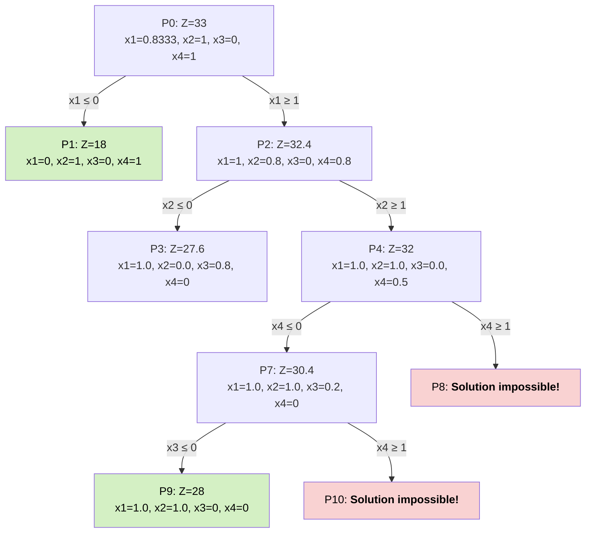
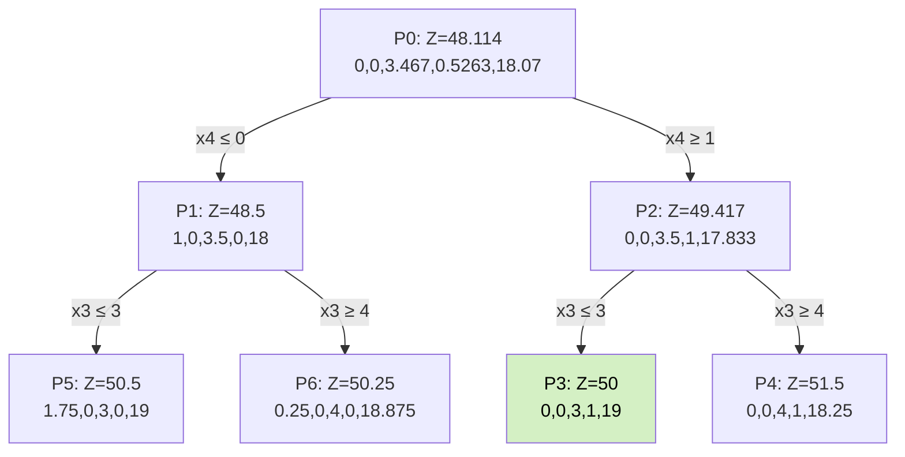

# optimisation

Ex1 :

```mermaid
graph TD
    P0["P0: Z=33<br>x1=0.8333, x2=1, x3=0, x4=1"] 
    P1["P1: Z=18<br>x1=0, x2=1, x3=0, x4=1<br>"] 
    P2["P2: Z=32.4<br>x1=1, x2=0.8, x3=0, x4=0.8"]
    P3["P3: Z=27.6<br>x1=1.0, x2=0.0, x3=0.8, x4=0<br>"] 
    P4["P4: Z=32<br>x1=1.0, x2=1.0, x3=0.0, x4=0.5<br>"]
    P7["P7: Z=30.4<br>x1=1.0, x2=1.0, x3=0.2, x4=0<br>"]
    P8["P8: <b>Solution impossible!</b>"]
    P9["P9: Z=28<br>x1=1.0, x2=1.0, x3=0, x4=0<br>"]
    P10["P10: <b>Solution impossible!</b>"]
    
    P0 -->|x1 ≤ 0| P1
    P0 -->|x1 ≥ 1| P2
    P2 -->|x2 ≤ 0| P3
    P2 -->|x2 ≥ 1| P4
    P4 -->|x4 ≤ 0| P7
    P4 -->|x4 ≥ 1| P8
    P7 -->|x3 ≤ 0| P9
    P7 -->|x4 ≥ 1| P10
    
    style P1 fill:#d4f0c4, color:black
    style P9 fill:#d4f0c4, color:black
    style P8 fill:#f9d2d2, color:black
    style P10 fill:#f9d2d2, color:black
```
Donc valeur optimale de Z=28 avec x1=1, x2=1, x3=0, x4=0

Ex 2:

```mermaid
graph TD
    P0["P0: Z=48.114<br>0,0,3.467,0.5263,18.07"] 
    P1["P1: Z=48.5<br>1,0,3.5,0,18"] 
    P2["P2: Z=49.417<br>0,0,3.5,1,17.833"]
    P3["P3: Z=50<br>0,0,3,1,19"] 
    P4["P4: Z=51.5<br>0,0,4,1,18.25"]
    P5["P5: Z=50.5<br>1.75,0,3,0,19"]
    P6["P6: Z=50.25<br>0.25,0,4,0,18.875"]
    
    P0 -->|x4 ≤ 0| P1
    P0 -->|x4 ≥ 1| P2
    P2 -->|x3 ≤ 3| P3
    P2 -->|x3 ≥ 4| P4
    P1 -->|x3 ≤ 3| P5
    P1 -->|x3 ≥ 4| P6
    
    style P3 fill:#d4f0c4, color:black
```

Donc valeur optimale de Z=50 avec 0,0,3,1,19 comme valeurs
